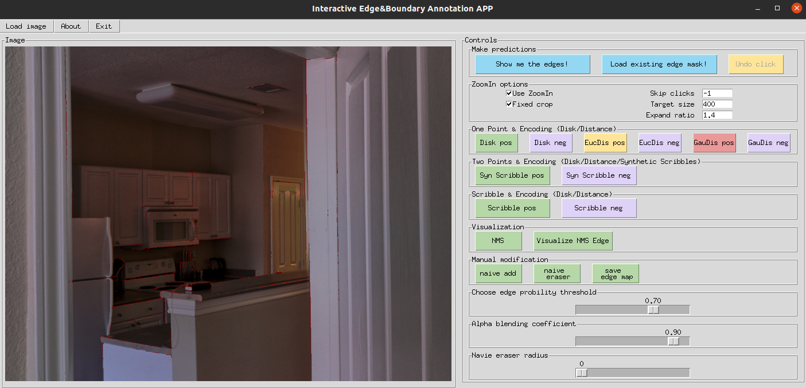

# GUI for IOBE

<p align="center">  </p>

## Preparation

1. Copy the **mtorl** and **isutils** directories from the **MS<sup>3</sup>PE** repository, or place the **GUI** code inside the **MS<sup>3</sup>PE** repository.
2. Prepare the Python environment using the `requirements.txt` file.
   - **Note:** The GUI was tested on a local CPU machine, so the environment may differ slightly from the one used in **MS<sup>3</sup>PE**.

------

## Usage

The GUI supports two modes:

1. **Predict occlusion boundaries** using a locally loaded model.
2. **Use existing predictions (masks)**, as in the real user case experiment described in the paper.

Our interactive mechanism is one-shot, so corrective scribbles can be drawn offline and then sent to the online device for refinement.

------

### Interaction and Encoding

- Multiple interaction methods: scribbles, points, etc.
- Multiple encoding modes: disk encoding, distance encoding, etc.
- Python NMS is enabled to visualize predicted results.
- Manual naive add and eraser functions are included for possible future edge/boundary annotation.

------

### Running the GUI

1. Modify parameters in `demo.py`.
2. The model is defined in `controller.py` (default: SwinS).
3. Most api functions are implemented in `app.py`.
4. Run the GUI:

```
python demo.py
```

- Check the terminal for log output.
- Click **Visualize NMS Edge** to see predicted occlusion boundaries (in red).

------

## Acknowledgment and Remarks

- Developed based on interactive segmentation methods (e.g., [RITM](https://github.com/saic-vul/ritm_interactive_segmentation)) and contributions from master student Yuan Kang.
- This GUI is not fully mature:
  - Some functions may need further refinements.
  - Certain features (like **undo click**) are not implemented yet.
