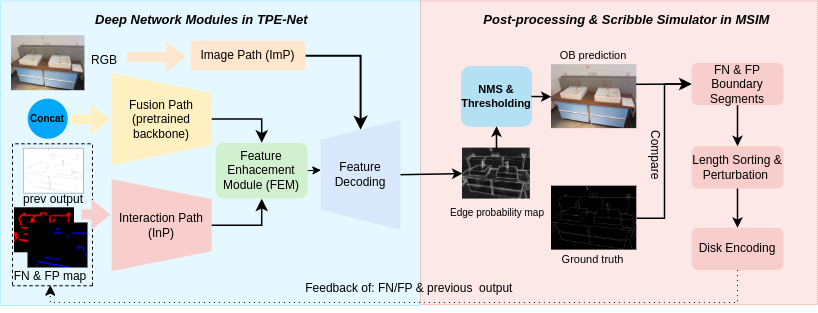

# MS<sup>3</sup>PE

This repository contains the PyTorch implementation of our proposed framework MS<sup>3</sup>PE, including the network as well as the code for interaction generation, training, and testing:

- **`isutils/`**: code for interaction generation and Python NMS.
- **`mtorl/`**: network and training code.
- **`evaTools/`**: MATLAB evaluation code (verified under MATLAB 2022b).

The general pipeline of MS<sup>3</sup>PE:
<p align="center">

</p>

------

## Dependencies

First, set up the Python environment according to `requirements.txt`.

```
# (Optional) create a virtual environment
pip install -r requirements.txt
```

## Data Preparation

Follow the **data repository** to download:

- The synthetic **OB-FUTURE** dataset.
- Two real-world subsets **OB-DIODE** and **OB-EntitySeg**.

------

## Configuration

- Update dataset paths and split files in **`config.yml`**.
- Adjust parameters in **`parse_args.py`** as needed.

------

## Training & Inference

Run the following script to train the model and generate predicted OB results:

```
# PS: upzip isutils.zip and mtorl/models.zip
# Check isutils/interactions.py for more interaction & encoding modes
sh scripts/run_swinl.sh
```

------

## Pre-trained Checkpoints

Follow the **Data repository** to download the pre-trained checkpoints.

------

## Evaluation under MATLAB

The evaluation code is modified from [MTORL](https://github.com/fengpanhe/MT-ORL) and [DOOBNet](https://github.com/GuoxiaWang/DOOBNet)

### Setup

- Prepare the MATLAB–Python environment as in [MTORL](https://github.com/fengpanhe/MT-ORL).
- Our code is verified under **MATLAB 2022b**.

### Note

The original test process evaluates edge probability thresholds from **0.01 to 0.99**.
 To save evaluation time, we evaluate only from **0.51 to 0.99**.

### Run evaluation

```
cd evaTools
sh local_eval.sh
```

------

## Acknowledgments

We borrowed code from the following projects and thank the authors for their great work: [MTORL](https://github.com/fengpanhe/MT-ORL), [SimpleClick](https://github.com/uncbiag/SimpleClick), [Python Edge NMS](https://github.com/Walstruzz/edge_eval_python?tab=readme-ov-file), and other works that inspired this project.
