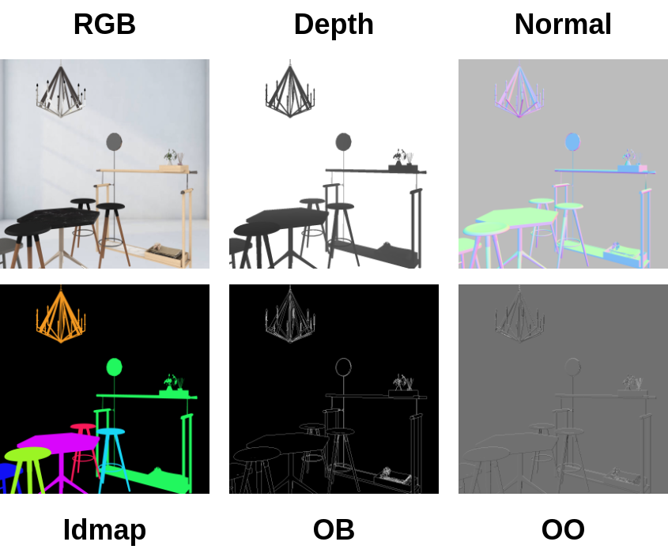

# OB Generation


## 1. Tool Overview

This repository contains two main components:

1. **Blender-based Scene Generator**
   - Built on **Blender v2.79b**.
   - Used to generate scene information such as geometry and rendering data.
2. **Mesh2OB**
   - Implements the mathematical definition of occlusion boundaries.
   - Generates occlusion boundary maps and additional information.


<p align="center">

</p>


## 2. **Blender-based Scene Generator**
 

This part of the code benefits from the [3D-FUTURE ToolBox](https://github.com/3D-FRONT-FUTURE/3D-FUTURE-ToolBox).

### Steps to Run

**1. Install Blender 2.79b**

- Download from the official site: [Blender 2.79b](https://www.blender.org/download/releases/2-79/).

**2. Modify the configuration file**

- Open `utils/configs.py`, and set the parameter `blender_path` to your local Blender installation path.
- Additional Blender-related variables can be found in both `configs.py` and `render_scene.py`.

**3. Run the pipeline**

```
# Use local Python to call Blender’s Python
python run_exrot_blender.py
```


## 3. Mesh2OB

This part of the code takes the camera projection matrix and mesh OBJ files as input, and outputs: occlusion boundary maps (OB), occlusion orientation maps (OO), etc. 

Main tools:

- Core functions are implemented in `utils/tools.py` and `geocc_discrete_buffer.py`.

- Parameters can be configured in `utils/configs.py`.

**Run the definition**

```
python geocc_discrete_buffer.py
```


**Note:** The released version of **Mesh2OB** is slightly different from the one described in the supplementary. Specifically:

- When constructing the weighted graph data structure, the edge weights are based on the Euclidean distance between nodes.
- Each node represents a point sampled from the mesh/triangle surface, rather than exactly as in the original paper.
